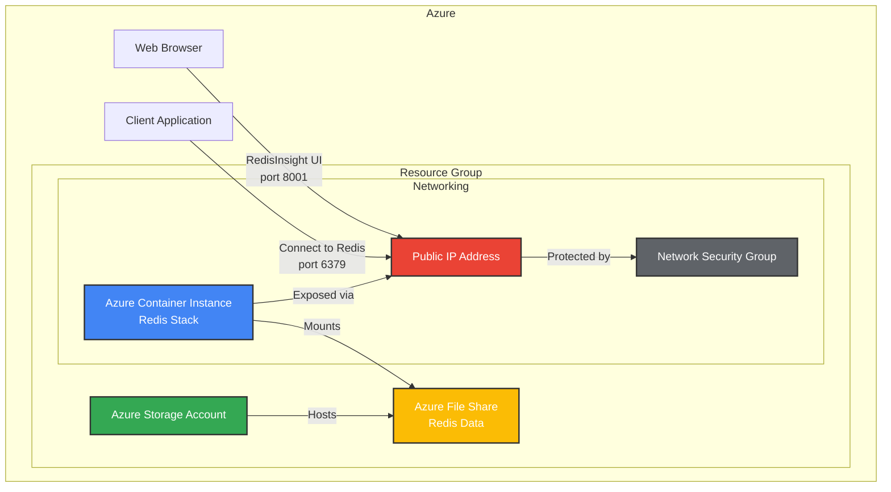
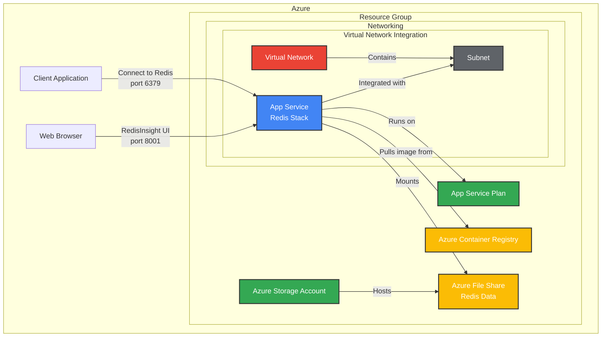
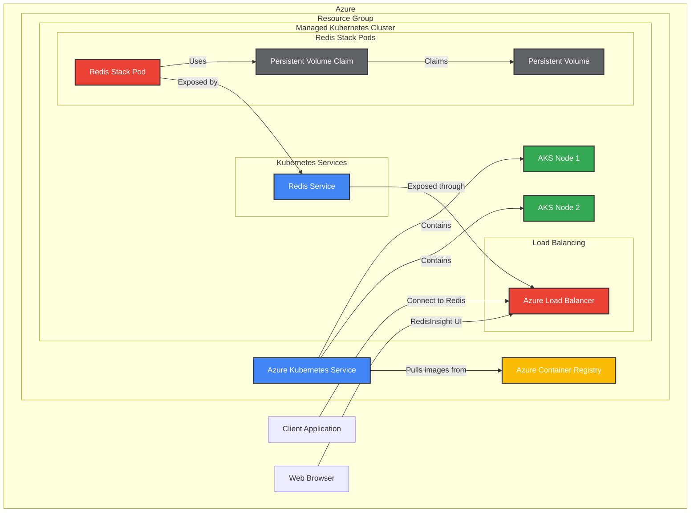
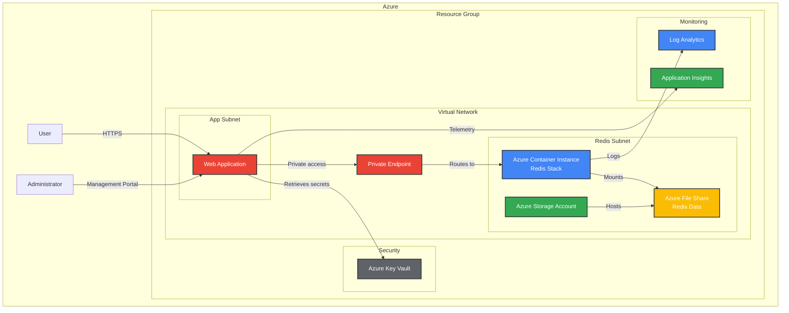

# Azure Architecture Diagrams

This document provides architecture diagrams for deploying Redis Stack in different Azure environments.

## Table of Contents

- [Azure Container Instances (ACI) Architecture](#azure-container-instances-aci-architecture)
- [Azure App Service Architecture](#azure-app-service-architecture)
- [Azure Kubernetes Service (AKS) Architecture](#azure-kubernetes-service-aks-architecture)

## Azure Container Instances (ACI) Architecture

### Key Components:

1. **Azure Container Instance (ACI)**: Hosts the Redis Stack container
2. **Azure File Share**: Provides persistent storage for Redis data files
3. **Public IP Address**: Entry point for client connections
4. **Network Security Group**: Controls network traffic to the container

### Data Flow:

1. The Redis Stack container stores its data in the mounted Azure File Share
2. Clients connect to Redis on port 6379
3. Web browsers connect to RedisInsight on port 8001
4. Network Security Group restricts access to authorized sources

## Azure App Service Architecture

### Key Components:

1. **App Service**: Platform for hosting the Redis Stack container
2. **App Service Plan**: Defines the compute resources for the App Service
3. **Azure Container Registry**: Stores the Redis Stack container image
4. **Azure File Share**: Provides persistent storage for Redis data files
5. **Virtual Network Integration**: Optional network isolation

### Data Flow:

1. The App Service pulls the Redis Stack image from Azure Container Registry
2. The container mounts the Azure File Share for data persistence
3. Clients connect to Redis on port 6379
4. Web browsers connect to RedisInsight on port 8001

## Azure Kubernetes Service (AKS) Architecture

### Key Components:

1. **Azure Kubernetes Service (AKS)**: Managed Kubernetes cluster
2. **Azure Container Registry**: Stores the Redis Stack container image
3. **Kubernetes Pods**: Run the Redis Stack containers
4. **Persistent Volumes**: Provide persistent storage for Redis data
5. **Kubernetes Services**: Expose Redis to the network
6. **Load Balancer**: Provides external access to the services

### Data Flow:

1. Kubernetes pulls the Redis Stack image from Azure Container Registry
2. Pods are scheduled on AKS nodes and use persistent volumes for data
3. Kubernetes services expose the Redis and RedisInsight ports
4. The load balancer routes external traffic to the appropriate service
5. Clients connect to Redis through the load balancer

## Secure Deployment Architecture

For a more secure production deployment, consider this enhanced architecture:

### Key Security Features:

1. **Virtual Network Isolation**: All components are in a private VNet
2. **Private Endpoints**: No public internet exposure for Redis
3. **Azure Key Vault**: Securely stores Redis credentials
4. **Subnet Segregation**: Web and Redis components in separate subnets
5. **Monitoring**: Comprehensive logging and monitoring

## Notes on Architecture Diagrams

These diagrams are created using Mermaid markdown syntax, which can be rendered by many markdown viewers including GitHub. To view these diagrams:

1. View this file in GitHub, which natively renders Mermaid diagrams
2. Use a Markdown editor that supports Mermaid (like VS Code with extensions)
3. Use the Mermaid Live Editor at [https://mermaid.live](https://mermaid.live)

The diagrams represent logical architecture and may need to be adapted based on your specific requirements and constraints.
