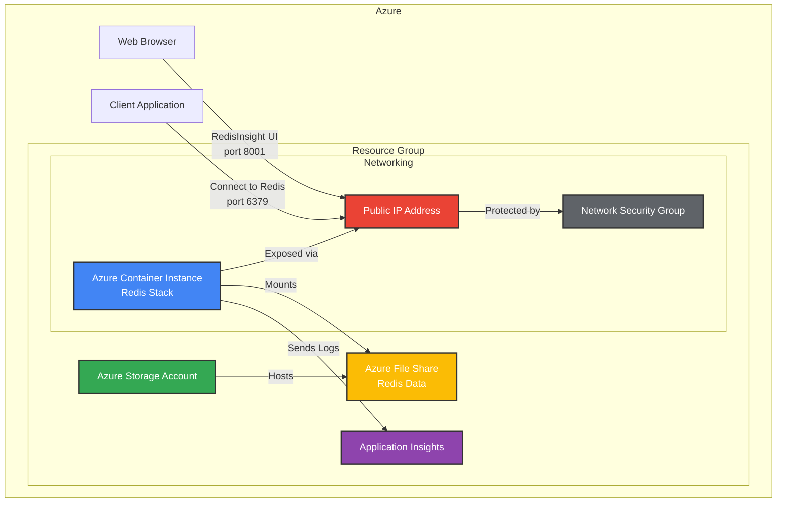
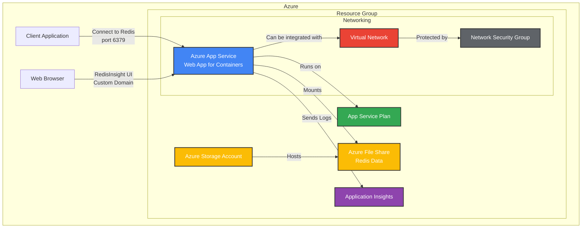
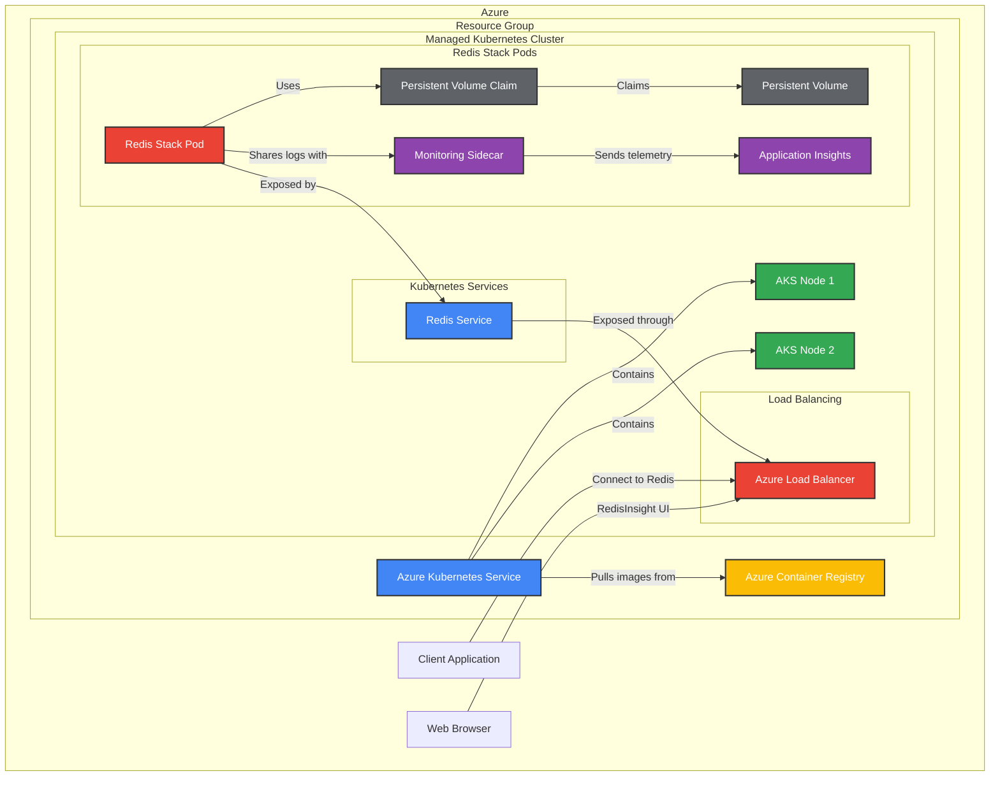
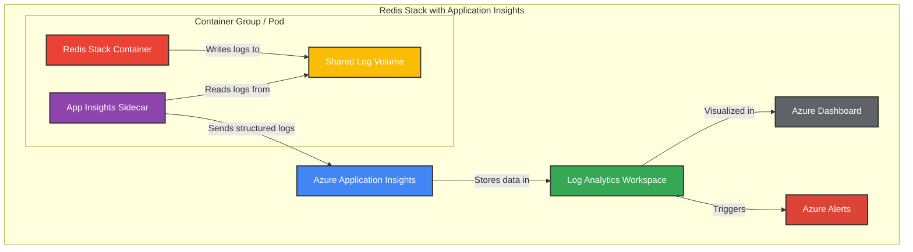

# Azure Architecture Diagrams

This document provides architecture diagrams for deploying Redis Stack in different Azure environments.

## Table of Contents

- [Azure Container Instances (ACI) Architecture](#azure-container-instances-aci-architecture)
- [Azure App Service Architecture](#azure-app-service-architecture)
- [Azure Kubernetes Service (AKS) Architecture](#azure-kubernetes-service-aks-architecture)
- [Monitoring Integration Architecture](#monitoring-integration-architecture)

## Azure Container Instances (ACI) Architecture

## Azure App Service Architecture

## Azure Kubernetes Service (AKS) Architecture

## Monitoring Integration Architecture

## Notes on Architecture Diagrams

These diagrams are created using Mermaid markdown syntax, which can be rendered by many markdown viewers including GitHub. To view these diagrams:

1. View this file in GitHub, which natively renders Mermaid diagrams
2. Use a Markdown editor that supports Mermaid (like VS Code with extensions)
3. Use an online Mermaid editor like [Mermaid Live Editor](https://mermaid-js.github.io/mermaid-live-editor/)
4. Install the Mermaid CLI to render these diagrams locally
